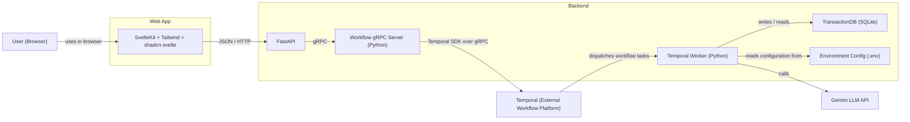

Here’s an updated minimal `README.md` for the new web flow:

# Architecture

## High-Level

```mermaid
flowchart LR
    user["User (Browser)"]
    frontend["SvelteKit Web App"]
    api["FastAPI"]
    grpc["gRPC Server"]
    temporal["Temporal"]
    gemini["Gemini LLM API"]

    user -->|"submits prompt to"| frontend
    frontend -->|"POST /prompt"| api
    api -->|"gRPC"| grpc
    grpc -->|"starts / queries workflows via"| temporal
    temporal -->|"runs workflow tasks"| gemini
```



## Low-Level



# Main technologies

- Frontend: `SvelteKit`, `Tailwind CSS`, `shadcn-svelte`
- Backend API: `FastAPI`, `uvicorn`
- RPC: `gRPC` / `grpcio`
- Workflow runtime: `Temporal`
- Storage: `SQLite`
- LLM: `Gemini`

# Setup order

## 1. Compile proto stubs

```bash
python -m proto.regen_proto
```

## 2. Initialise the database

```bash
python storage/init_db.py
```

## 3. Add your Gemini API key

```bash
echo "GEMINI_API_KEY=your_key_here" > .env
```

# Running locally

## Terminal 1 — Run back-end

```bash
./start.sh
```

## Terminal 2 — Run front-end

```bash
./start-web.sh
```

## Logs
All logs for both terminals stored in logs/

# Local URLs

- Frontend: `http://localhost:5173`
- FastAPI: `http://localhost:8000`
- Health check: `http://localhost:8000/healthz`

# Notes

- The browser does not talk to gRPC directly.
- The frontend sends JSON/HTTP requests to FastAPI.
- FastAPI calls the existing gRPC server.
- Responses are rendered as plain text in the UI.

# CI / Docker

`Dockerfile` contains the deps, `docker.yml` contains the container image workflow, and `tests.yml` contains the CI jobs based on that image.

## Running Docker locally

```bash
colima start
docker build -t ci-test .
docker run --rm -it -v "$PWD:/app" -w /app ci-test sh
colima stop
```

# Links / Credentials

## Gemini usage

https://aistudio.google.com/

## Braintrust

https://www.braintrust.dev/app/snitkdan-test/p/My%20Project?onboarding=true

## Google Account

https://myaccount.google.com/
