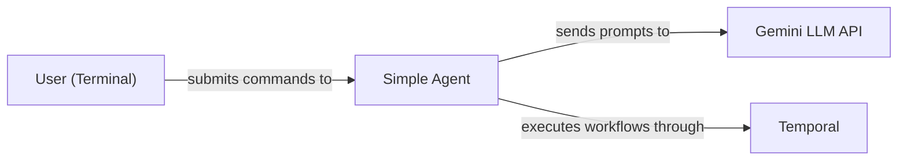
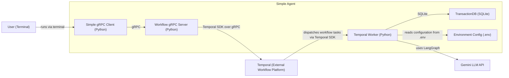

# Architecture
## High-Level


## Low-Level


# Setup order

### 1. Compile proto stubs

```bash
python -m proto.regen_proto
```

### 2. Initialise the database

```bash
python storage/init_db.py
```

### 3. Add your Gemini API key

```bash
echo "GEMINI_API_KEY=your_key_here" > .env
```

# Running (3 terminals, all from project root)
## Script-based
```
$ ./start.sh
```
Kicks off background jobs for temporal, worker, and gRPC server. 

Check running background jobs with `$ jobs -l`.

## Manual
### Terminal 1 — Temporal dev server

```bash
temporal server start-dev
```

### Terminal 2 — Temporal worker

```bash
python -m workflow.worker
```

### Terminal 3 — gRPC server

```bash
python -m server.grpc_server
```

## Sending a prompt

```bash
python -m client.grpc_client "What is the speed of light?"
```
# CI / Docker
Dockerfile contains the deps, docker.yml contains the container image workflow, tests.yml contains the actual CI jobs based on this container image. 

## Running docker file locally
```i
$ colima start # starts the docker daemon
$ docker build -t ci-test . # build the container locally
$ docker run --rm -it -v "$PWD:/app" -w /app ci-test sh # interactive shell within container
$ # run commands like you would in the venv
$ colima stop
```

# Links / Credentials
## View Gemini usage here
https://aistudio.google.com/

## Braintrust
https://www.braintrust.dev/app/snitkdan-test/p/My%20Project?onboarding=true
 
## Google Account (for AppPasswords)
https://myaccount.google.com/